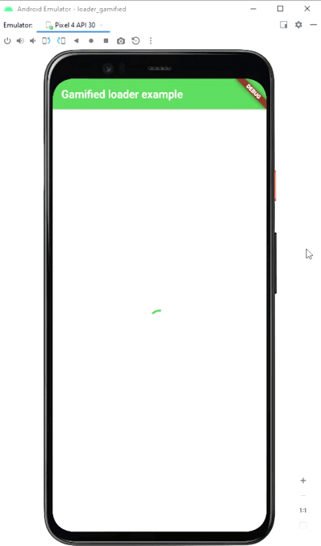

# Gamified loader widget

Loader with a mini game inside it

Often users might have connection issues or the server response time might be increased. This plugin provides a loader widget with a small game incorporated inside it to keep the user engaged. Initially it will show a specified loader, but after some predefined period of time it will switch to the game.

## Features

Delay can be specified
Uses app theme's colors
Any progress indicator can be used

## Games available

Currently, only Shulte table is available as a game.

## Demo



## Usage

Just initialize a widget with specified loader and time to show this loader before the game starts

```
GamifiedLoader(
  loader: CircularProgressIndicator(),
  loaderTimeMs: 5000,
)
```